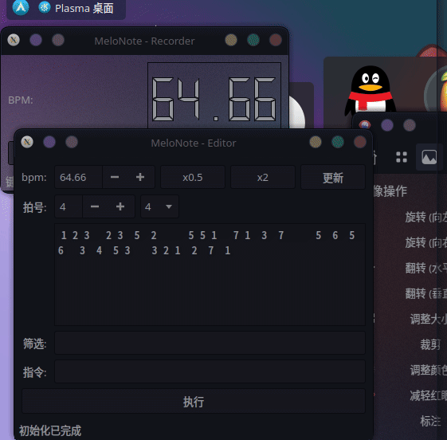

# MeloNote

轻量的旋律灵感记录器。

> 主要功能基本完成。


## Feature

- [x] 按键录制
- [x] BPM 推断
- [x] midi 导出
- [x] 区段筛选编辑
- [ ] 量化后导出
- [ ] 自定义配置
- [ ] 命令批处理



## 解决痛点与适用场景

- 拿纸记灵感又记不好节奏
- 不愿意打开 DAW 随后陷入音色选择困难症
- 录制灵感不愿听到声音反馈
## 运行环境

- [x] Linux x86_64 
- [x] Windows x86_64 (存在小问题)
- [ ] MacOS (?)
- [ ] Android (?)

## 构建

- 依赖
  - Qt (>=6, 5 未测试)
  - cmake >= 3.5
  - (可选)字体 Monospace

```bash
cd workspace
mkdir build
cd build
cmake ..
make
```

## 使用说明
### 录制界面

- 按下 `Start` 后按旋律节奏按下键盘按键即可。
> 数字键、小键盘均可。字母键后续处理步骤较多。

### 编辑界面

#### 显示说明

- 旋律框显示的为键盘录制时记录到的内容。
- 空格长度一定程度反映了按键间的时间间隔。
- 左上角标用于表示升降
- 右上角标用于表示**提升**的八度数
- 右下角标用于表示**降低**的八度数
- 无角标 `1` 表示 **中央C**
- 无角标 `6` 对应 **440 Hz** 的 A 音

#### 操作流程

1. 选中要操作的音符
1. 填入筛选、指令字段
1. 执行

#### 筛选

在选中的音符中进一步筛选要操作的内容。

#### 指令

指令为一串字符。从左至右依次执行。

|指令|说明|
|-|-|
|b|标记为降|
|#|标记为升|
|0|取消升降标记|
|+|向上移动一个八度|
|-|向下移动一个八度|
|r_|将操作对象替换为 `_`。 `_` 为一任意字符|